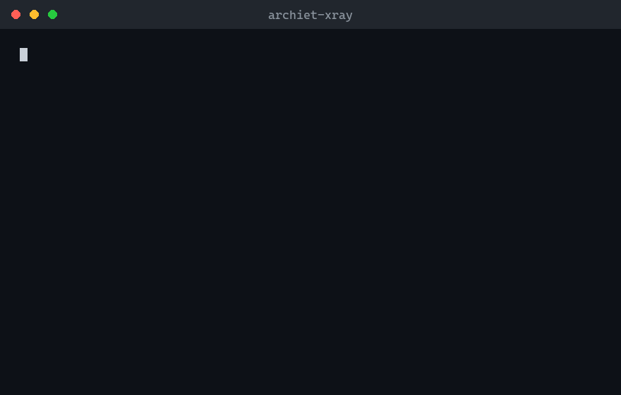

# Archiet X-Ray



**See what your AI sees.** Your codebase is too big for any AI agent's context
window. The agent reads 40 files out of 4,000, makes a change, and you have no
way to know whether it respected the architecture — or quietly violated it.

X-Ray extracts the *actual* architecture of any repo — deterministically, no
LLM, code never leaves your machine — and gives it to both **you** (an
interactive map) and **your AI agent** (an MCP server + context pack).

```
$ python xray.py .

Archiet X-Ray v0.1.0 — your-repo
  visibility score : 78/100
  code files       : 3,412 (1,907 mapped)
  routes           : 214
  entities         : 87
  async tasks      : 31
  findings         : 6
  wrote            : .archiet/ARCHITECTURE.md
                     .archiet/AGENT_CONTEXT.md
                     .archiet/architecture.json
```

## What you get

| File | What it is |
|---|---|
| `ARCHITECTURE.md` | Human-readable map: module dependency graph (Mermaid), domain model, every route with auth status, dependency hotspots, risk findings |
| `AGENT_CONTEXT.md` | Drop into your CLAUDE.md / rules file — makes Claude Code, Cursor, and Windsurf respect your architecture *today* |
| `architecture.json` | The machine-readable model (the "repo genome") |

## Give it to your agent (MCP)

```bash
# Claude Code
claude mcp add archiet-xray -- python /path/to/mcp_server.py /path/to/repo
```

Your agent can now ask — *before* it edits:

- **`blast_radius`** — "who depends on this file? what breaks if I touch it?"
- **`arch_summary`** — "where do routes/entities/services actually live?"
- **`boundary_findings`** — "hardcoded secrets, raw SQL, tokens in localStorage, unauthenticated routes"
- **`xray_scan`** — re-scan after structural changes

## Principles

1. **Deterministic.** Same repo in, same map out. Every fact traces to a file
   and line. No LLM guesses anywhere in the pipeline.
2. **Honest.** What can't be extracted with confidence is labelled *unmapped*
   — never invented. A wrong map is worse than no map.
3. **Local-first.** Stdlib only, zero network calls, zero telemetry. Your code
   never leaves your machine.

## What it extracts today

- **Python**: Flask / FastAPI routes (+ auth-guard detection), SQLAlchemy &
  Django models with relations, Celery tasks, import graph — via `ast`, not regex
- **JS/TS**: Next.js app & pages router (pages + API routes), Express routes,
  Prisma models, import graph
- **Findings**: hardcoded secrets, raw SQL bypassing the ORM, auth tokens in
  localStorage/AsyncStorage, routes without auth guards
- **Graph**: module dependency edges, fan-in/fan-out, blast-radius hotspots

More stacks (Go, Java, Rails, .NET) welcome — the extractor pattern is one
class per language. PRs invited.

## Real examples

[`examples/`](examples/) holds unedited X-Ray output for repos you know —
microblog (Flask), the official FastAPI full-stack template, and
vercel/commerce (Next.js). GitHub renders the Mermaid maps inline. On the
FastAPI template, X-Ray correctly detects `CurrentUser` dependency auth on 18
routes and flags a real auth-token-in-localStorage write in `useAuth.ts`.

## FAQ

**How is this different from a dependency-graph MCP server (Codegraph, dependency-mcp)?**
Those show call/import edges. X-Ray extracts *web-architecture semantics* on top
of the graph: which routes exist, which carry auth guards, where the domain
entities live, and where security boundaries leak (hardcoded secrets, raw SQL,
tokens in localStorage). No graph tool tells you "510 of your routes have no
detectable auth guard."

**How is this different from a CLAUDE.md generator?**
CLAUDE.md generators write *instructions and conventions* — usually with an
LLM. X-Ray extracts *facts*: every claim in its output traces to a file and
line, and what it can't extract it labels unknown. Use both: your conventions
plus X-Ray's ground truth.

**What does auth status `?` mean?**
"Not detectable from per-function analysis." FastAPI routers often attach auth
at `include_router(dependencies=...)` level, which is invisible when analyzing
the route function. X-Ray reports unknown rather than guessing a confident
"no auth" — a wrong map is worse than no map.

**Does it phone home?**
No. Stdlib-only, zero network calls, zero telemetry. The only outbound anything
is a link in the generated footer.

## Part of Archiet

X-Ray is the free, open companion to [Archiet](https://archiet.com) — the
architecture-to-code platform. The map X-Ray extracts is the same formal model
Archiet uses to *enforce* architecture on every PR (boundary gates, drift
scoring, consulting-grade architecture reports) and to regenerate
production-ready applications from it.

MIT licensed.
