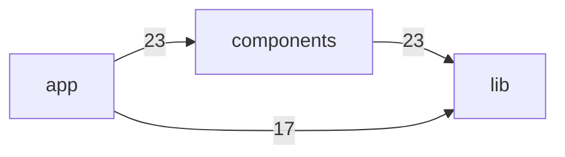

# Architecture Map — `commerce`

**Visibility score: 63/100** · 65 code files · 6 routes · 0 entities · 0 async tasks · 65 files read, 6 with extracted elements (0 unreadable)

## System map (module dependencies)

## Domain model

_No ORM entities detected._

## Entry points

| Method | Path | Handler | Auth | File |
|---|---|---|---|---|
| GET | `/` | `page` | ? | `app/page.tsx`:1 |
| GET | `/:page` | `page` | ? | `app/[page]/page.tsx`:1 |
| POST | `/api/revalidate` | `route` | ? | `app/api/revalidate/route.ts`:1 |
| GET | `/product/:handle` | `page` | ? | `app/product/[handle]/page.tsx`:1 |
| GET | `/search` | `page` | ? | `app/search/page.tsx`:1 |
| GET | `/search/:collection` | `page` | ? | `app/search/[collection]/page.tsx`:1 |

## Async tasks

_None detected._

## Dependency hotspots (highest blast radius)

- **lib/shopify** — 27 dependents, 0 dependencies
- **components/layout** — 10 dependents, 23 dependencies
- **components/grid** — 9 dependents, 23 dependencies
- **lib/constants** — 9 dependents, 0 dependencies
- **components/cart** — 6 dependents, 23 dependencies
- **lib/utils** — 6 dependents, 0 dependencies
- **components/opengraph-image** — 3 dependents, 23 dependencies
- **components/product** — 2 dependents, 23 dependencies
- **components/prose** — 2 dependents, 23 dependencies
- **components/price** — 2 dependents, 23 dependencies

## Findings

_No boundary findings from the deterministic rule set._

---
*Generated by [Archiet X-Ray](https://archiet.com) v0.1.1 — deterministic architecture extraction, no LLM guesses. Unmapped areas are labelled, never invented.*
