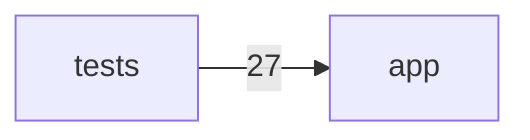
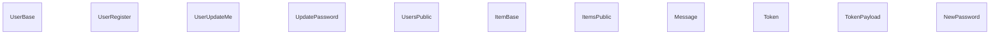

# Architecture Map — `full-stack-fastapi-template`

**Visibility score: 82/100** · 141 code files · 23 routes · 11 entities · 0 async tasks · 141 files read, 6 with extracted elements (0 unreadable)

## System map (module dependencies)

## Domain model

## Entry points

| Method | Path | Handler | Auth | File |
|---|---|---|---|---|
| GET | `/` | `read_items` | ✅ | `backend/app/api/routes/items.py`:14 |
| POST | `/` | `create_item` | ✅ | `backend/app/api/routes/items.py`:62 |
| GET | `/` | `read_users` | ✅ | `backend/app/api/routes/users.py`:37 |
| POST | `/` | `create_user` | ✅ | `backend/app/api/routes/users.py`:57 |
| GET | `/health-check/` | `health_check` | ? | `backend/app/api/routes/utils.py`:30 |
| POST | `/login/access-token` | `login_access_token` | ✅ | `backend/app/api/routes/login.py`:24 |
| POST | `/login/test-token` | `test_token` | ✅ | `backend/app/api/routes/login.py`:46 |
| PATCH | `/me` | `update_user_me` | ✅ | `backend/app/api/routes/users.py`:82 |
| GET | `/me` | `read_user_me` | ✅ | `backend/app/api/routes/users.py`:125 |
| DELETE | `/me` | `delete_user_me` | ✅ | `backend/app/api/routes/users.py`:133 |
| PATCH | `/me/password` | `update_password_me` | ✅ | `backend/app/api/routes/users.py`:104 |
| POST | `/password-recovery-html-content/{email}` | `recover_password_html_content` | ✅ | `backend/app/api/routes/login.py`:105 |
| POST | `/password-recovery/{email}` | `recover_password` | ? | `backend/app/api/routes/login.py`:54 |
| POST | `/reset-password/` | `reset_password` | ? | `backend/app/api/routes/login.py`:78 |
| POST | `/signup` | `register_user` | ? | `backend/app/api/routes/users.py`:147 |
| POST | `/test-email/` | `test_email` | ✅ | `backend/app/api/routes/utils.py`:16 |
| POST | `/users/` | `create_user` | ? | `backend/app/api/routes/private.py`:24 |
| GET | `/{id}` | `read_item` | ✅ | `backend/app/api/routes/items.py`:49 |
| PUT | `/{id}` | `update_item` | ✅ | `backend/app/api/routes/items.py`:76 |
| DELETE | `/{id}` | `delete_item` | ✅ | `backend/app/api/routes/items.py`:100 |
| GET | `/{user_id}` | `read_user_by_id` | ✅ | `backend/app/api/routes/users.py`:163 |
| PATCH | `/{user_id}` | `update_user` | ✅ | `backend/app/api/routes/users.py`:187 |
| DELETE | `/{user_id}` | `delete_user` | ✅ | `backend/app/api/routes/users.py`:215 |

## Async tasks

_None detected._

## Dependency hotspots (highest blast radius)

- **app/core** — 30 dependents, 0 dependencies
- **app/models** — 16 dependents, 0 dependencies
- **tests/utils** — 11 dependents, 27 dependencies
- **app/api** — 7 dependents, 0 dependencies
- **app/utils** — 4 dependents, 0 dependencies
- **app/main** — 1 dependents, 0 dependencies
- **app/crud** — 1 dependents, 0 dependencies
- **app/backend_pre_start** — 1 dependents, 0 dependencies
- **app/tests_pre_start** — 1 dependents, 0 dependencies

## Findings

- **[high] token-in-localstorage** `frontend/src/hooks/useAuth.ts`:45 — Auth token written to localStorage/AsyncStorage — prefer httpOnly cookies.
- **[info] token-in-localstorage** `frontend/tests/login.spec.ts`:112 — Auth token written to localStorage/AsyncStorage — prefer httpOnly cookies.

---
*Generated by [Archiet X-Ray](https://archiet.com) v0.1.1 — deterministic architecture extraction, no LLM guesses. Unmapped areas are labelled, never invented.*
