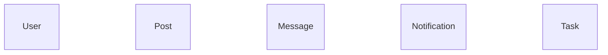

# Architecture Map — `microblog`

**Visibility score: 78/100** · 34 code files · 27 routes · 5 entities · 0 async tasks · 34 files read, 5 with extracted elements (0 unreadable)

## System map (module dependencies)

## Domain model

## Entry points

| Method | Path | Handler | Auth | File |
|---|---|---|---|---|
| GET,POST | `/` | `index` | ✅ | `app/main/routes.py`:28 |
| GET,POST | `/edit_profile` | `edit_profile` | ✅ | `app/main/routes.py`:99 |
| GET | `/explore` | `explore` | ✅ | `app/main/routes.py`:56 |
| GET | `/export_posts` | `export_posts` | ✅ | `app/main/routes.py`:221 |
| POST | `/follow/<username>` | `follow` | ✅ | `app/main/routes.py`:116 |
| GET,POST | `/index` | `index` | ✅ | `app/main/routes.py`:28 |
| GET,POST | `/login` | `login` | ⚠️ none detected | `app/auth/routes.py`:15 |
| GET | `/logout` | `logout` | ⚠️ none detected | `app/auth/routes.py`:34 |
| GET | `/messages` | `messages` | ✅ | `app/main/routes.py`:201 |
| GET | `/notifications` | `notifications` | ✅ | `app/main/routes.py`:232 |
| GET,POST | `/register` | `register` | ⚠️ none detected | `app/auth/routes.py`:40 |
| GET,POST | `/reset_password/<token>` | `reset_password` | ⚠️ none detected | `app/auth/routes.py`:73 |
| GET,POST | `/reset_password_request` | `reset_password_request` | ⚠️ none detected | `app/auth/routes.py`:56 |
| GET | `/search` | `search` | ✅ | `app/main/routes.py`:167 |
| GET,POST | `/send_message/<recipient>` | `send_message` | ✅ | `app/main/routes.py`:183 |
| POST | `/tokens` | `get_token` | ✅ | `app/api/tokens.py`:8 |
| DELETE | `/tokens` | `revoke_token` | ✅ | `app/api/tokens.py`:16 |
| POST | `/translate` | `translate_text` | ✅ | `app/main/routes.py`:158 |
| POST | `/unfollow/<username>` | `unfollow` | ✅ | `app/main/routes.py`:137 |
| GET | `/user/<username>` | `user` | ✅ | `app/main/routes.py`:73 |
| GET | `/user/<username>/popup` | `user_popup` | ✅ | `app/main/routes.py`:91 |
| GET | `/users` | `get_users` | ✅ | `app/api/users.py`:18 |
| POST | `/users` | `create_user` | ⚠️ none detected | `app/api/users.py`:46 |
| GET | `/users/<int:id>` | `get_user` | ✅ | `app/api/users.py`:12 |
| PUT | `/users/<int:id>` | `update_user` | ✅ | `app/api/users.py`:66 |
| GET | `/users/<int:id>/followers` | `get_followers` | ✅ | `app/api/users.py`:27 |
| GET | `/users/<int:id>/following` | `get_following` | ✅ | `app/api/users.py`:37 |

## Async tasks

_None detected._

## Dependency hotspots (highest blast radius)

- **app/api** — 10 dependents, 0 dependencies
- **app/models** — 9 dependents, 0 dependencies
- **app/auth** — 5 dependents, 0 dependencies
- **app/main** — 4 dependents, 0 dependencies
- **app/errors** — 3 dependents, 0 dependencies
- **app/email** — 2 dependents, 0 dependencies
- **app/search** — 1 dependents, 0 dependencies
- **app/cli** — 1 dependents, 0 dependencies
- **app/translate** — 1 dependents, 0 dependencies

## Findings

_No boundary findings from the deterministic rule set._

---
*Generated by [Archiet X-Ray](https://archiet.com) v0.1.1 — deterministic architecture extraction, no LLM guesses. Unmapped areas are labelled, never invented.*
